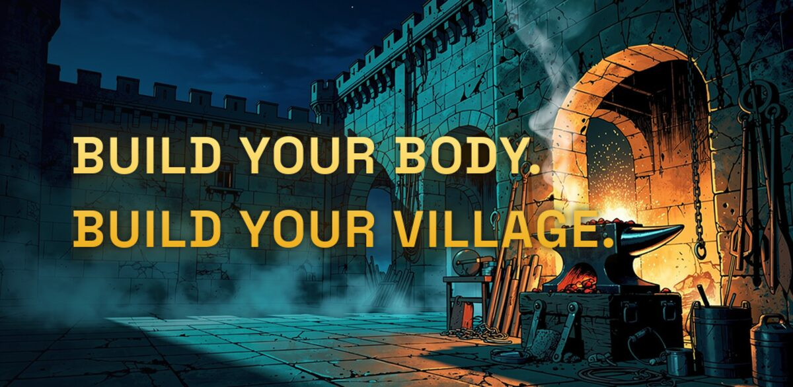
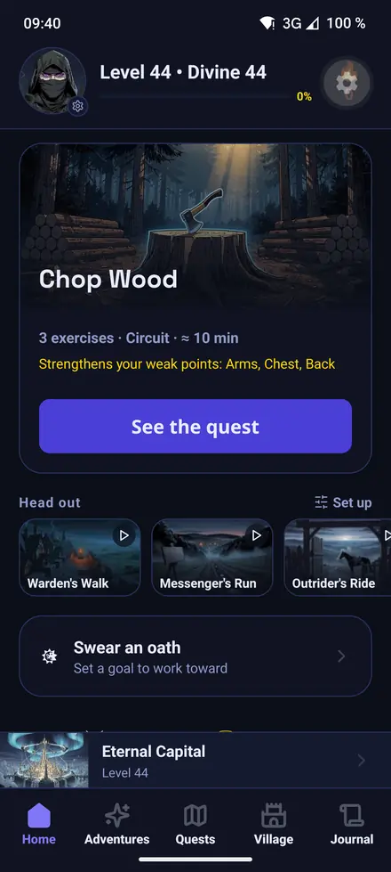
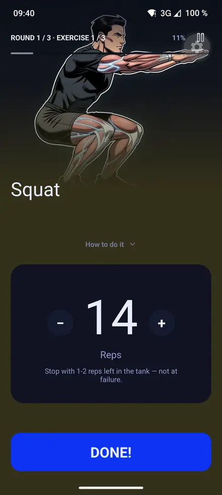
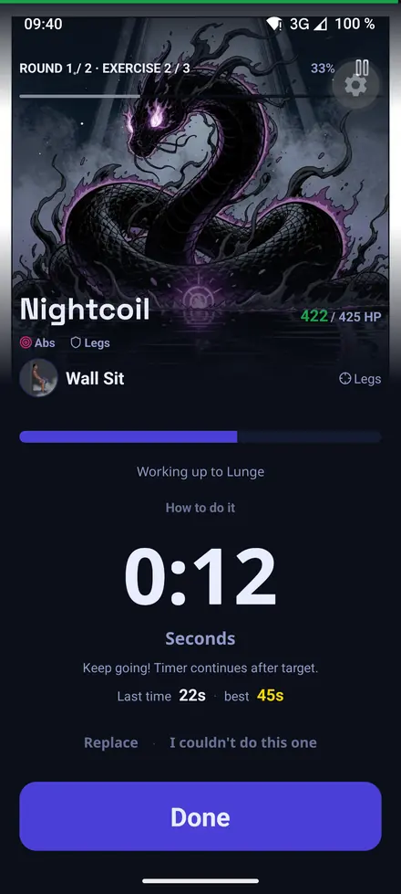
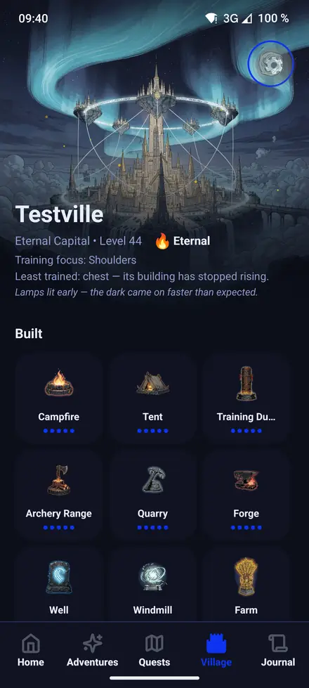

<div align="center">

<a href="https://guiforge.github.io/bati/"></a>

# Bati

**Train like a hero, build like a king.**

A dark-fantasy fitness RPG. Your workouts are quests, your reps are damage,
and the village you build is made of what you actually lifted.

<a href="https://f-droid.org/packages/com.guiforge.bati/"></a>
<a href="https://github.com/Guiforge/bati/releases/latest"></a>

<br />

**[guiforge.github.io/bati](https://guiforge.github.io/bati/)** — the site, in English and French

[](https://github.com/Guiforge/bati/actions/workflows/ci.yml)
[](https://github.com/Guiforge/bati/releases/latest)
[](LICENSE)


</div>

A workout is a quest. Your reps land as damage on a boss. The muscles you actually train raise
the buildings of a village that grows out of what you lifted — not out of what you bought.

Sport first, RPG second: the training logic leads and the game amplifies it. Nothing decorative
gets between you and your next set.

It is built for people who train alone and lose the thread, at home, in a gym, or on a road out of
town. No coach, no feed, no leaderboard, nobody to compare yourself to. The only thing keeping
score is a village that can only be built by showing up.

**Your training stays on your phone.** No account, no servers, no analytics, no ads. Your history
lives in a database on the device and is never uploaded. Bati asks for internet access for exactly
one thing: the map tiles behind an expedition's route, fetched from `tiles.openfreemap.org`. No
other part of the app is allowed to open a connection: a lint rule rejects every network call
written in JavaScript, so a second destination cannot arrive by accident. That is the architecture,
not a setting you have to find.

> **Early days.** The app works end to end and is published through F-Droid, which is where its
> first users came from. It is not on Google Play: that account exists and has never left its
> internal track.

## See it

<div align="center">
<table border="0">
<tr>
<td width="25%"></td>
<td width="25%"></td>
<td width="25%"></td>
<td width="25%"></td>
</tr>
<tr align="center">
<td><sub>Your next session, one tap away.</sub></td>
<td><sub>One exercise at a time.</sub></td>
<td><sub>Some sessions fight back.</sub></td>
<td><sub>Your reps built all of this.</sub></td>
</tr>
</table>

</div>

## What it does

**Every workout is a quest.** A campaign with a story, chapters and a map. You pick the next
quest, and it knows what you trained last.

**Your reps land as damage.** Finish a set and the boss takes the hit. The bar moves because you
moved, and the fight is over when the session is.

**Some sessions fight back.** Boss fights close a chapter and ask for a real effort: the one
session in the arc you have to show up for.

**The village is made of what you lifted.** Train shoulders, the forge rises. Nothing in it can be
bought, skipped or rushed; every building is a receipt for work you actually did.

**Some quests leave the walls.** Walking, running and riding are expeditions: a session measured
in ground covered rather than repetitions. The distance comes from the app's own GPS module,
written against Android's `LocationManager` with no Google library anywhere near it, and the
leagues it records raise the High Road, the one building in the village that nothing you lift can
level.

**Years of history, on one screen.** Streaks, records, muscle balance and every session you ever
finished, read from a database on your phone, with nothing to log in to.

**No account, and one network destination.** There is no server to leak, no analytics to opt out
of, and no cloud copy of your training. The only thing Bati ever fetches is map tiles, from
`tiles.openfreemap.org`; nothing travels the other way, and the trace of your route stays in the
database on your phone. [Privacy policy](https://guiforge.github.io/bati/privacy/).

## Install it

All of this is also on [the site](https://guiforge.github.io/bati/#install), in English and French.

### F-Droid — the one that updates itself

Bati is in [the official F-Droid catalogue](https://f-droid.org/packages/com.guiforge.bati/):
that is what the badge above opens, and searching F-Droid for "Bati" finds it. **Installed from
GitHub Releases before that?** F-Droid signs its builds with its own key, so the catalogue cannot
update that copy (Android refuses a different signature, and uninstalling takes your hero with it).
Keep the self-hosted repository instead — same APKs, same key, updates arriving like any other
app's — see [`docs/fdroid.md`](docs/fdroid.md).

[**Add the repository to F-Droid**](https://fdroid.link/#https://guiforge.github.io/bati/fdroid/repo?fingerprint=089db12838d660caf285be855d8e6d023407a50d98051b3843095ea09bba2d97)

By hand instead — *Settings → Repositories → +* — paste the address, and check that F-Droid shows
this fingerprint before you accept it:

```text
https://guiforge.github.io/bati/fdroid/repo
089D B128 38D6 60CA F285 BE85 5D8E 6D02 3407 A50D 9805 1B38 4309 5EA0 9BBA 2D97
```

That fingerprint is the whole security model of a self-hosted repository: it pins the key every
future update must be signed with. Adding the address without checking it trusts whatever answers
at that URL.

### A plain APK

[Releases](https://github.com/Guiforge/bati/releases): Android will ask you to allow installs
from an unknown source the first time. Nothing updates itself this way; you download the next one
yourself.

See [`docs/fdroid.md`](docs/fdroid.md) for how the repository is built and signed.

---

*Everything below is for reading or building the code.*

## Written with AI

This project is largely written with AI assistance. Saying it up front so you read the code
with that in mind. It is a fun project: I build it because I enjoy building it.

## Where the art comes from

Every illustration in `assets/` — exercise art, quest and adventure covers, boss portraits,
village buildings, avatars — is **AI-generated**. Nothing is stock, and nothing is traced from a
specific artist's work.

All of it comes from **FLUX.2 by Black Forest Labs**, through our own API account. That detail is
the licence: the FLUX grant over outputs runs to whoever holds the key, so generating through an
aggregator would have left us with art we could not license onward, which is why an earlier
Midjourney-and-Gemini-via-Mammouth set was regenerated from scratch.

Icons are a separate system: game and fantasy icons go through the project's own icon hook,
utility icons come from [`@tamagui/lucide-icons`](https://tamagui.dev).

## Quick start

```bash
npm install
npm start          # Expo dev server
```

Running on a device needs a dev build (`npm run android` / `npm run ios`), because the app uses
native modules: SQLite, audio, an Android home-screen widget, MapLibre, and `modules/bati-location`,
the location service this repo owns. Expo Go loads none of them.

## Scripts

| Command | What it runs |
| --- | --- |
| `npm start` | Expo dev server |
| `npm run android` / `ios` / `web` | run on a target |
| `npm run check` | Biome + TypeScript |
| `npm test` | Jest |
| `npm run deadcode` | dead-code check |
| `npm run maestro` | Maestro E2E flows (needs a device) |
| `npm run db:generate` / `db:push` | Drizzle migrations |

## Quality gates

All of these run in CI; the first three also run on commit or push.

- **Biome** — formatting and lint, including four GritQL plugins written for this repo. One
  rejects raw hex colours outside [`constants/rawColors.ts`](constants/rawColors.ts); another
  ([`noJsNetwork.grit`](.biome/plugins/noJsNetwork.grit)) rejects `fetch`, `XMLHttpRequest`,
  `WebSocket`, `EventSource` and `sendBeacon` anywhere in the app, which is what keeps "one host"
  a fact rather than a sentence in this file.
- **TypeScript**, strict.
- **Jest** — ~1200 tests, with coverage thresholds set just under actual so they catch deletion
  rather than reward padding.
- **Knip** — dead code. At zero; anything it reports is new.
- **expo-doctor** — 20 checks on dependency versions and project shape, all green. A version the
  installed SDK does not expect builds fine here and fails for whoever rebuilds from source.
- **Maestro** — end-to-end flows against a real device.

## Project layout

- `app/` — Expo Router screens (file-based routing)
- `components/` — UI, grouped by feature
- `db/` — SQLite + Drizzle domain logic; the source of truth for game rules
- `stores/` — Zustand state (session, settings, user)
- `constants/` — game design constants and the colour palette
- `modules/` — local Expo modules; `bati-location` is the Kotlin GPS service
- `docs/` — the wiki: product, design, gameplay, architecture, planning
- `.maestro/` — E2E flows
- `plugins/` — local Expo config plugins

## Contributing

[`CONTRIBUTING.md`](CONTRIBUTING.md) for code, [`docs/CONTRIBUTING.md`](docs/CONTRIBUTING.md) for
the wiki, [`SECURITY.md`](SECURITY.md) to report something that should not be a public issue.
Or just write to **<feedback.bati@proton.me>**. An idea is welcome in whatever form it arrives.

## Licence

[MIT](LICENSE) for the code, [CC BY-SA 4.0](https://creativecommons.org/licenses/by-sa/4.0/) for
the artwork in `assets/`.

The illustrations are generated with FLUX.2 by Black Forest Labs through our own API account,
whose licence places no ownership claim on outputs and allows any use. `scripts/provenance.json`
records the model, prompt and seed behind every one of them, so fork away: the art comes with
you, and you can regenerate it yourself.

Most of the exercise illustrations in `assets/images/exercises/` are *derived* work on top of
that: FLUX redrew them from anatomical line studies by
[Everkinetic](https://github.com/everkinetic/data), reframed by
[workout-guide](https://github.com/bryllim/workout-guide), both CC BY-SA 4.0. Credit is due to
Everkinetic and Bryl Lim, and the share-alike obligation is already satisfied by the licence
above. It binds the images, never the app code. `scripts/provenance.json` names the source frame
for each one.

Two exceptions keep their own terms: the [game-icons.net](https://game-icons.net) set
(CC BY 3.0 / CC0) and the store badges.
