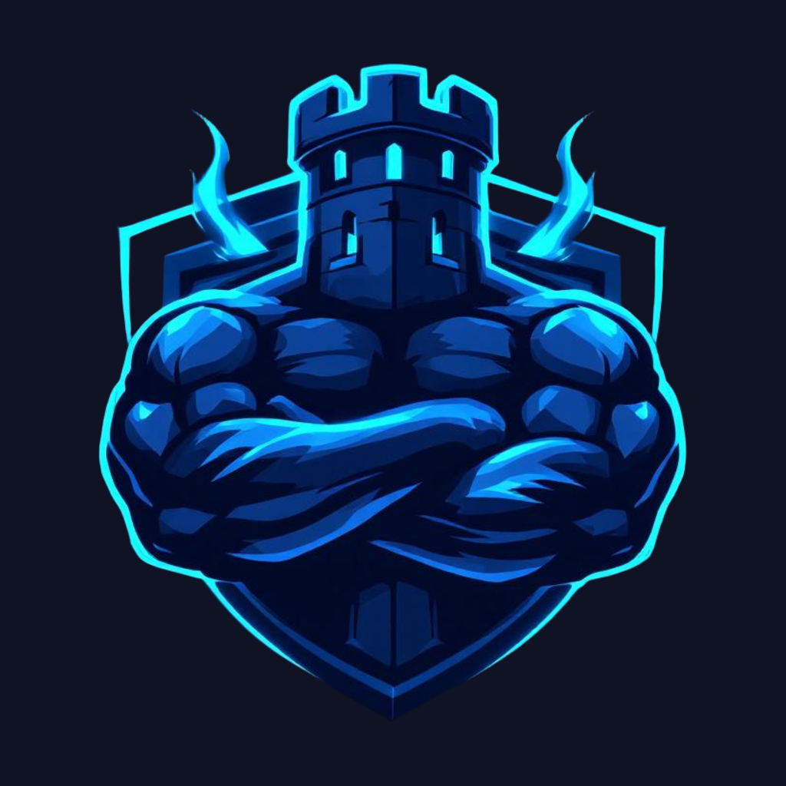

<div align="center">



# Bati

**Train like a hero, build like a king.**

[](https://github.com/Guiforge/bati/actions/workflows/ci.yml)


</div>

Bati is a dark-fantasy fitness RPG built with **Expo + React Native + Tamagui**. Workouts drive
progression: the app turns training into quests, adventures, boss fights, and a village that
grows out of what you actually lifted.

**Status: pre-release.** Not on either store yet. See [`road2release.md`](road2release.md) for
what is left, and why the remaining work is mostly paperwork rather than code.

## This repo is heavily vibe coded, and says so

Most of this codebase was written with AI assistance, in long conversations rather than
carefully planned sprints. That is not an apology — it is context you need to read it fairly:

- **The comments are unusually dense**, and they explain *why*, not *what*. Many of them are
  small post-mortems: a comment saying "this used to be X, and here is the bug that caused" is
  doing the job a commit message would in a repo with a slower pulse. Read them; they carry most
  of the reasoning.
- **The docs are large for a project this size.** `docs/` holds product, design, gameplay and
  architecture knowledge that would otherwise live in someone's head. It is also what makes
  AI-assisted work reviewable — [`AGENTS.md`](AGENTS.md) and [`DESIGN.md`](DESIGN.md) are the
  rules an assistant is held to, and auditing the code *against its own written rules* is how
  the bugs in [`audit.md`](audit.md) were found.
- **The conventions are opinionated and enforced by tooling**, not by discipline. Dark-mode
  only, tokens instead of hex, one source per value. Where a rule could be automated it was —
  including a custom lint plugin that rejects raw hex colours anywhere but one file.
- **Expect the seams.** Some of it is over-thought, some under-thought. The `ponytail:` comments
  mark deliberate shortcuts with their ceiling and what would trigger the real fix, so the
  corners that were cut are at least labelled.

It is a fun project first. If you are here to learn, the interesting parts are probably
[`audit.md`](audit.md) — a full quality audit and what came of it — and the way `docs/` plus the
lint rules try to keep an AI-assisted codebase honest.

## Where the art comes from

Every illustration in `assets/` — exercise art, quest and adventure covers, boss portraits,
village buildings, avatars — is **AI-generated**. Nothing is stock, and nothing is traced from a
specific artist's work.

It happened in two waves, which is worth knowing if the styles ever look slightly off from each
other:

- **The original ~40 assets: Midjourney v6.** Prompts and exact parameters are committed in
  [`docs/content/image-prompts.md`](docs/content/image-prompts.md).
- **Later additions — the generic exercises, extra covers, village buildings: Google Gemini
  image models** (`gemini-3-pro-image-preview` and the flash variants), through the Mammouth
  API. Those runs are scripts rather than prose: [`scripts/generate-covers.py`](scripts),
  `generate-exercises.py`, `generate-village.py`. They need a `MAMMOUTH_API_KEY`.

The house style is written down rather than remembered, which is what keeps two different
generators producing the same world:
[`docs/content/image-style-prompt.md`](docs/content/image-style-prompt.md) — Franco-Belgian BD,
thick outlines, saturated cel-shading, edges fading to dark so an image drops onto the app's
`#0B0F19` background without a visible seam. What still has no art is tracked in
[`docs/content/missing-image.md`](docs/content/missing-image.md).

`scripts/generate_image_mistral.py` is a red herring — Mistral has no image generation API, so
it only helps *write* prompts for the generators above.

Icons are a separate system: game and fantasy icons go through the project's own icon hook,
utility icons come from [`@tamagui/lucide-icons`](https://tamagui.dev).

## Quick start

```bash
npm install
npm start          # Expo dev server
```

Running on a device needs a dev build (`npm run android` / `npm run ios`), because the app uses
native modules — SQLite, audio, notifications, an Android home-screen widget.

## Scripts

| | |
|---|---|
| `npm start` | Expo dev server |
| `npm run android` / `ios` / `web` | run on a target |
| `npm run check` | Biome + TypeScript |
| `npm test` | Jest |
| `npm run knip` | dead-code check |
| `npm run maestro` | Maestro E2E flows (needs a device) |
| `npm run db:generate` / `db:push` | Drizzle migrations |

## Quality gates

All of these run in CI; the first three also run on commit or push.

- **Biome** — formatting and lint, including a GritQL plugin that rejects raw hex colours
  outside [`constants/rawColors.ts`](constants/rawColors.ts).
- **TypeScript**, strict.
- **Jest** — ~430 tests, with coverage thresholds set just under actual so they catch deletion
  rather than reward padding.
- **Knip** — dead code. At zero; anything it reports is new.
- **Maestro** — end-to-end flows against a real device.

## Project layout

- `app/` — Expo Router screens (file-based routing)
- `components/` — UI, grouped by feature
- `db/` — SQLite + Drizzle domain logic; the source of truth for game rules
- `stores/` — Zustand state (session, settings, user)
- `constants/` — game design constants and the colour palette
- `docs/` — the wiki: product, design, gameplay, architecture, planning
- `.maestro/` — E2E flows
- `plugins/` — local Expo config plugins

## Documentation

- [`docs/README.md`](docs/README.md) — entry point
- [`AGENTS.md`](AGENTS.md) — working rules, quality rules, known debt
- [`DESIGN.md`](DESIGN.md) — design system and its non-negotiables
- [`PRODUCT.md`](PRODUCT.md) — who it is for, and what it refuses to be
- [`audit.md`](audit.md) — quality audit: 17 findings, what was fixed, what was deliberately not

## Licence

None yet. No `LICENSE` file means default copyright — all rights reserved. The code is public to
be read, not to be reused as-is. If you want to do something with it, ask.

The generated art carries the terms of whichever model produced it — Midjourney's for the
original batch, Google's for the Gemini additions — separately from whatever licence the code
eventually gets.
